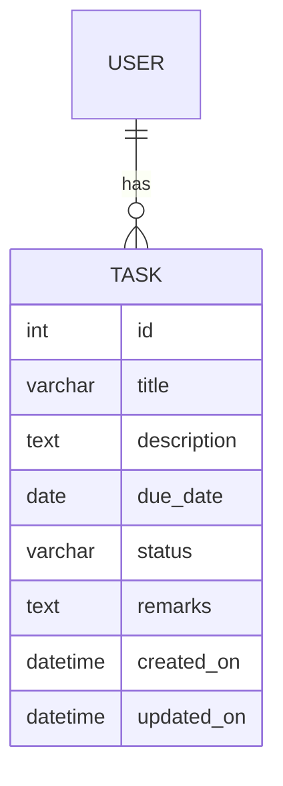

# 📝 Task Manager

## Overview

The Task Manager is a web-based application built using Django. It allows users to create, update, delete, and view tasks. Each task includes a title, description, status, due date, remarks, and timestamps. The platform also supports user authentication to ensure that tasks are user-specific and secure.

---

## Database Design

### ER Diagram



### Data Dictionary

| Field        | Type          | Description                        |
|--------------|---------------|------------------------------------|
| id           | AutoField     | Primary key                        |
| title        | CharField(200)| Title of the task                  |
| description  | TextField     | Detailed description of the task   |
| due_date     | DateField     | Deadline of the task               |
| status       | CharField(20) | Status: Pending, In Progress, Completed |
| remarks      | TextField     | Optional remarks                   |
| created_on   | DateTimeField | Auto timestamp on creation         |
| updated_on   | DateTimeField | Auto timestamp on update           |
| created_by   | ForeignKey(User) | Creator of the task             |
| updated_by   | ForeignKey(User) | Last editor of the task         |

### Indexes Used

By default, Django creates indexes for:
- Primary keys (`id`)
- Foreign keys (`created_by`, `updated_by`)
- Any field used in filtering or lookup (e.g., `status`, `title`)


## Application Structure

### Project Folder Structure

```
taskmanager/
│
├── taskmanager/             # Project configuration
│   ├── settings.py
│   ├── urls.py
│   └── ...
│
├── tasks/                   # App for task management
│   ├── admin.py
│   ├── apps.py
│   ├── forms.py
│   ├── models.py
│   ├── tests.py
│   ├── views.py
│   ├── urls.py
│   ├── static/
│   │   └── tasks/
│   │       ├── form.css
│   │       └── styles.css
│   └── templates/
│       ├── base.html
│       ├── registration/
│       │   └── login.html
│       └── tasks/
│           ├── task_confirm_delete.html
│           ├── task_form.html
│           └── task_list.html
│
├── db.sqlite3
└── manage.py
```


## Frontend Structure

### Frontend Type Used

**Web-based frontend** using **HTML + CSS** (via Django Templates).


## Build and Install Instructions

### Environment & Dependencies

#### 🔧 Requirements:
- Python 3.10+
- Django 4.x
- SQLite (default)
- `pip` for managing Python packages

### Build / Compile Instructions

```bash
# Clone the repository
git clone https://github.com/yourusername/taskmanager.git
cd taskmanager

# Create virtual environment
python -m venv venv
source venv/bin/activate  # On Windows: venv\Scripts\activate


# Run migrations
python manage.py makemigrations
python manage.py migrate
```

### Run / Install Instructions

```bash
# Create a superuser (optional but recommended)
python manage.py createsuperuser

# Run development server
python manage.py runserver

```
